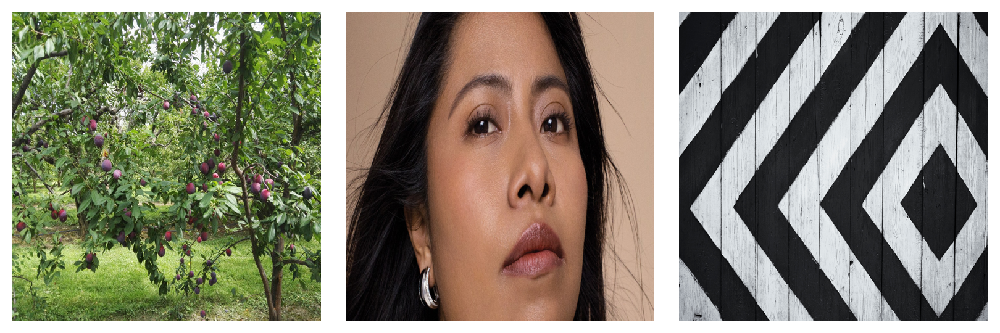

<h1 align="center">Celery Python Collage Maker</h1>

<p align="center">Asynchronously create image collages with Python, Celery, Pillow, and RabbitMQ.</p>


## Example Image




## Built With

- Python
- Celery
- RabbitMQ
- Pillow


# Usage

Install RabbitMQ.

```
$ sudo apt install rabbitmq

$ sudo systemctl enable rabbitmq

$ sudo systemctl start rabbitmq
```

Start the virtual environment.

```
$ pipenv shell
```

Install the dependencies.

```
$ pipenv install
```

Start Celery...

In one terminal run:

```
$ celery -A project.tasks worker --loglevel=info
```

Add three images called `pic1.jpg`, `pic2.jpg`, and `pic3.jpg` in the project directory.

In another terminal run:

```
$ pipenv shell

$ python3 main.py
```

## Author

**Brandon Wallace**

- [Profile](https://github.com/brandon-wallace "Brandon Wallace")

- [Website](https://brandonwallace.cc "Personal Website")

## Support

Contributions, issues, and feature requests are welcome!

Give a ⭐️ if you like this project!
